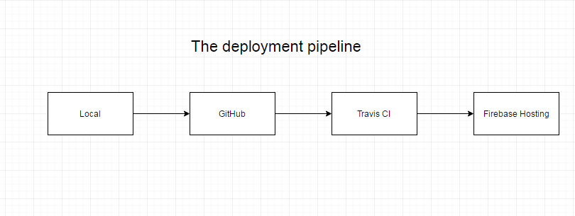

### Prerequisites

- nodejs
- yarn or npm (package manager)
- create-react-app (scaffolding)
- Firebase CLI (hosting)

### Create a new application (pl-example)

- `$ create-react-app pl-example && cd pl-example`
- run tests `$ yarn test --coverage`
- run application `$ yarn start`

### Create Git Repo (pl-example)

- Create GitHub repo

configure a remote repository:

`git remote add <name> <url>`

then push using the remote name:

`git push <name>`

**rule 1:** "master" is always backed up and deployable!

### Create Hosting

Create a new project in the [Firebase Console](https://console.firebase.google.com)

Then in your project folder:

- Initialize a firebase app: `firebase init`, then select "Hosting". Use "build" for your hosting directory
- After initialization is complete then add the project: `firebase use --add`

```sh
 ~/Code/pl-example   master  firebase init

     ######## #### ########  ######## ########     ###     ######  ########
     ##        ##  ##     ## ##       ##     ##  ##   ##  ##       ##
     ######    ##  ########  ######   ########  #########  ######  ######
     ##        ##  ##    ##  ##       ##     ## ##     ##       ## ##
     ##       #### ##     ## ######## ########  ##     ##  ######  ########

You're about to initialize a Firebase project in this directory:

  /Users/Dan/Code/pl-example

? Which Firebase CLI features do you want to setup for this folder? Press Space to select features, then
Enter to confirm your choices. Hosting: Configure and deploy Firebase Hosting sites

=== Project Setup

First, let's associate this project directory with a Firebase project.
You can create multiple project aliases by running firebase use --add,
but for now we'll just set up a default project.

? Select a default Firebase project for this directory: [create a new project]

=== Hosting Setup

Your public directory is the folder (relative to your project directory) that
will contain Hosting assets to be uploaded with firebase deploy. If you
have a build process for your assets, use your build's output directory.

? What do you want to use as your public directory? build
? Configure as a single-page app (rewrite all urls to /index.html)? Yes
✔  Wrote build/index.html

i  Writing configuration info to firebase.json...
i  Writing project information to .firebaserc...

✔  Firebase initialization complete!

Project creation is only available from the Firebase Console
Please visit https://console.firebase.google.com to create a new project, then run firebase use --add
 ~/Code/pl-example   master  firebase use --add
? Which project do you want to add? pl-example
? What alias do you want to use for this project? (e.g. staging) production

Created alias production for pl-example.
Now using alias production (pl-example)
 ~/Code/pl-example   master 
```

### Add Bootstrap

- Install Bootstrap and SCSS support: `$ yarn add node-sass bootstrap`
- Create "scss" folder inside "src"
- Copy "bootstratp.scss" and "main.scss" from Library to `/scss`
- Add `import './scss/main.scss';` to app.js

FYI: https://helpx.adobe.com/experience-manager/6-4/sites/developing/using/spa-getting-started-react.html

### CI/CD pipeline

[Deploy to Firebase Hosting from GitHub](https://medium.com/@cpavnn/deploy-to-firebase-hosting-from-github-3772fed05e72)
[YouTube](https://www.youtube.com/watch?v=QLVzozWDYAs)



##### Travis CI env variables:

- FIREBASE_TOKEN="token"
- REACT_APP_GOOGLE_MAPS_API_KEY="yours"
- TZ="America/Los_Angeles"

To integrate with Travis CI, we need a Firebase token.

- Type in command line `firebase login:ci`

```sh
~/Code/pl-example   master  firebase login:ci

Visit this URL on any device to log in:
https://accounts.google.com/o/oauth2/auth?client_id=5634335869-fgrhgmd47bqnekij5i8b5pr03ho849e6.apps.googleusercontent.com&scope=email%20openid%20https%3A%2F%2Fwww.googleapis.com%2Fauth%2Fcloudplatformprojects.readonly%20https%3A%2F%2Fwww.googleapis.com%2Fauth%2Ffirebase%20https%3A%2F%2Fwww.googleapis.com%2Fauth%2Fcloud-platform&response_type=code&state=734277424&redirect_uri=http%3A%2F%2Flocalhost%3A9005

Waiting for authentication...

✔  Success! Use this token to login on a CI server:

1/_0baOCKMLTnexI7tJbdGhaYxKz2LGZqe-5tE2lmpmUk

Example: firebase deploy --token "$FIREBASE_TOKEN"

 ~/Code/pl-example   master 
```

Copy the token, we will need this for Travis CI

Create .travis.yml file in the root of the project:

```yml
language: node_js
node_js:
  - 'stable'

# Container-based builds do not have the sudo privilege,
# so they must rely on other means to install. For example:
sudo: false
before_install:
  - curl -o- -L https://yarnpkg.com/install.sh | bash -s -- --version 1.12.3
  - export PATH=$HOME/.yarn/bin:$PATH

cache:
  yarn: true

install:
  - yarn install

script:
  - yarn test
  - yarn build

deploy:
  on:
    branch: master
  skip_cleanup: true
  provider: firebase
  token:
    - $FIREBASE_TOKEN
```

Make sure you replace projectId with the actual projectId, which can be found in the firebase console

### Setting Up Travis CI

https://medium.com/@bartwijnants/continuous-deployment-to-firebase-hosting-using-travis-ci-e7d9c798ead4

- Login to "travis-ci.com"
- Click on signin with GitHub
- Click on "+" sign next to my repositories

Go to Github and turn on the repo - **don't let Travis turn on all repos**

Now click the "more options" and choose settings for the repository. Under "Environment Variables" add "FIREBASE_TOKEN" and the previously generated token via firebase login:ci

### Start developing

- Create routing

  ```js
  import React from 'react';
  import { Router } from '@reach/router';
  import './App.css';

  // parts
  const Nav = () => (
    <div>
      <a href="/">Home</a>
      <a href="/about">About</a>
    </div>
  );

  const Page1 = () => <h1>Page1</h1>;
  const Page2 = () => <h1>Page2</h1>;
  const Footer = () => <div>Footer</div>;

  const App = () => {
    return (
      <div className="App">
        <Nav />
        <Router>
          <PageHome path="/" />
        </Router>
        <Footer />
      </div>
    );
  };

  export default App;
  ```

- Create `pages` and `components` folders
- Find a "real" NavBar and Footer (corporate components library)
- Create our pages and tests. Test (need `yarn add react-test-renderer`):

  ```js
  import React from 'react';
  import renderer from 'react-test-renderer';
  import PageHome from 'PageHome';

  test('Home renders the home page', () => {
    const component = renderer.create(<PageHome />);
    let tree = component.toJSON();
    expect(tree).toMatchSnapshot();
  });
  ```

### Turn on service worker

In `index.js` change `serviceWorker.unregister();` - remove the "un".

### Perform bundle analysis

install webpack-bundle-analyzer globally: `npm install webpack-bundle-analyzer -g`

run your build with the `--stats` option: `yarn build --stats`

then analyze the .json output: `webpack-bundle-analyzer ./build/bundle-stats.json`
